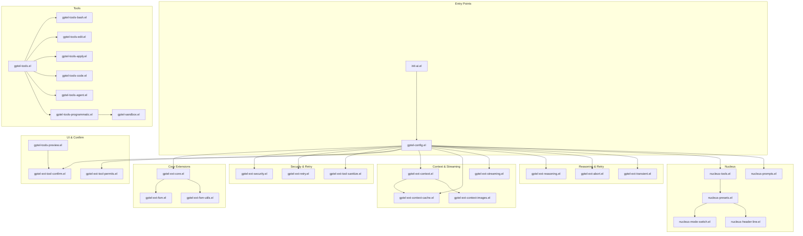

# Module Architecture

> Visual guide to nucleus module dependencies, advice chains, and data flow.

## Overview

The nucleus system is built on **gptel** (upstream LLM chat engine) with layered extensions for:
- Tool orchestration (31 tools)
- FSM recovery and retry logic
- Confirmation UI and preview
- Security ACLs and sandboxing
- Preset management (plan/agent modes)

## Layer Architecture

```
┌─────────────────────────────────────────────────────────────────────┐
│                          User Interface                              │
│  ai-code-menu (C-c a)  │  gptel-menu  │  nucleus-header-line        │
└───────────────────────────┬─────────────────────────────────────────┘
                            │
┌───────────────────────────▼─────────────────────────────────────────┐
│                        Preset Layer                                  │
│  nucleus-presets.el  │  nucleus-mode-switch.el  │  nucleus-prompts  │
│  (gptel-plan ↔ gptel-agent toggle, system prompt injection)         │
└───────────────────────────┬─────────────────────────────────────────┘
                            │
┌───────────────────────────▼─────────────────────────────────────────┐
│                        Tool Layer                                    │
│  nucleus-tools.el ──► gptel-tools-*.el (31 tools)                   │
│  │                    │                                              │
│  ├── :readonly ──────► Read, Grep, Glob, Code_*, Introspection      │
│  ├── :nucleus ───────► All tools (agent mode)                       │
│  ├── :explorer ──────► Glob, Grep, Read                             │
│  └── :reviewer ──────► Glob, Grep, Read                             │
└───────────────────────────┬─────────────────────────────────────────┘
                            │
┌───────────────────────────▼─────────────────────────────────────────┐
│                      Extension Layer                                 │
│  gptel-ext-*.el (14 modules)                                        │
│  ┌─────────────┬─────────────┬─────────────┬─────────────┐          │
│  │ Security    │ Retry       │ Confirm     │ FSM         │          │
│  │ (ACL router)│ (backoff)   │ (UI)        │ (recovery)  │          │
│  ├─────────────┼─────────────┼─────────────┼─────────────┤          │
│  │ Reasoning   │ Streaming   │ Sanitize    │ Abort       │          │
│  │ (thinking)  │ (jit-lock)  │ (nil-tool)  │ (timeout)   │          │
│  ├─────────────┼─────────────┼─────────────┴─────────────┤          │
│  │ Context     │ Transient   │ (menu extensions)         │          │
│  │ (compact)   │             │                           │          │
│  └─────────────┴─────────────┴───────────────────────────┘          │
└───────────────────────────┬─────────────────────────────────────────┘
                            │
┌───────────────────────────▼─────────────────────────────────────────┐
│                       Core Layer                                     │
│  gptel-ext-core.el  │  gptel-ext-fsm-utils.el                        │
│  (temp dir, markdown compat, curl hardening, tool registry audit)   │
└───────────────────────────┬─────────────────────────────────────────┘
                            │
┌───────────────────────────▼─────────────────────────────────────────┐
│                     Upstream gptel                                   │
│  gptel.el  │  gptel-request.el  │  gptel-curl.el  │  gptel-openai   │
│  (LLM chat, FSM, streaming, tool calling)                           │
└─────────────────────────────────────────────────────────────────────┘
```

## Module Dependency Graph



## Advice Chain Map

Advice functions wrap upstream gptel functions to add behavior.

### FSM Transition Chain

```
gptel--fsm-transition
    │
    ├── :around ← my/gptel-auto-retry (exponential backoff)
    │               │
    │               ├── On 429/timeout → retry with backoff
    │               └── On failure → trim payload & retry
    │
    └── :after ← my/gptel--recover-fsm-on-error
```

### Tool Execution Chain

```
gptel-make-tool
    │
    ├── :around ← nucleus-tools--advise-make-tool (depth 20)
    │               └── Add tool contracts
    │
    └── :around ← my/gptel-tool-router-advice (depth 10)
                    │
                    ├── Check ACL (plan mode whitelist)
                    ├── Force confirm outside workspace
                    └── Wrap with security checks

gptel--handle-tool-use
    │
    ├── :before ← my/gptel--sanitize-tool-calls
    │               └── Filter nil tools
    │
    ├── :before ← my/gptel--detect-doom-loop
    │               └── Abort repeated identical calls
    │
    └── :before ← my/gptel--dedup-tools-before-parse
                    └── Deduplicate tool definitions

gptel--display-tool-calls
    │
    └── :override ← my/gptel--display-tool-calls
                    │
                    ├── Minibuffer confirmation
                    └── Overlay confirmation (transient)
```

### Request Preparation Chain

```
gptel-curl-get-response
    │
    └── :before ← my/gptel--compact-payload
                    │
                    ├── Estimate JSON bytes
                    ├── If over limit → 4-pass trim:
                    │   1. Tool results
                    │   2. Reasoning content
                    │   3. Tools array
                    │   4. Aggressive trim
                    └── Reset retries to 0

gptel-curl--get-args
    │
    ├── :before ← my/gptel--pre-serialize-sanitize-messages
    │
    ├── :before ← my/gptel--pre-serialize-inject-reasoning
    │               └── Add thinking instructions
    │
    └── :before ← my/gptel--pre-serialize-inject-noop
                    └── Add _noop if no tools

gptel--parse-buffer
    │
    └── :around ← my/gptel--parse-buffer-repair-reasoning
                    └── Fix missing/invalid reasoning_content
```

### Streaming Chain

```
gptel-curl--stream-insert-response
    │
    ├── :before ← my/gptel--stream-set-flag
    │               └── Set streaming flag for jit-lock protection
    │
    └── :after ← my/gptel--stream-clear-flag

jit-lock-function
    │
    └── :around ← my/gptel--jit-lock-safe
                    └── Suppress errors in gptel-mode buffers
```

### Agent Chain

```
gptel-agent--task
    │
    └── :override ← my/gptel-agent--task-override
                    │
                    ├── Track parent buffer
                    ├── Truncate large results
                    └── Handle (tool-result . ...) events

gptel-agent-update
    │
    └── :around ← my/gptel--around-agent-update
                    └── Deregister upstream "Agent" tool
```

## Hook Chain Map

### gptel-mode-hook

```
gptel-mode-hook
    │
    ├── my/gptel--mode-hook-setup
    │   └── Markdown config, temp dir setup
    │
    ├── my/gptel--set-default-directory-to-project-root
    │
    ├── nucleus-sync-tool-profile
    │   └── Sync tools to current preset
    │
    └── nucleus-tool-sanity-check
        └── Verify all registered tools
```

### gptel-post-response-functions

```
gptel-post-response-functions
    │
    ├── gptel-end-of-response
    │
    ├── gptel-auto-scroll
    │
    ├── my/gptel-add-prompt-marker
    │   └── Mark prompt boundaries
    │
    ├── my/gptel-auto-compact
    │   └── Compact if approaching context limit
    │
    ├── my/gptel--recover-fsm-on-error
    │   └── Fix stuck FSM states
    │
    └── my/gptel--stream-clear-flag
```

### gptel-tools-after-register-hook

```
gptel-tools-after-register-hook
    │
    └── nucleus--refresh-open-gptel-buffers
        └── Update presets after tool registration
```

## Data Flow

### Request Flow

```
User Input
    │
    ▼
gptel-request
    │
    ├── nucleus-presets (apply preset)
    │   └── Set backend/model/tools
    │
    ├── gptel-ext-security (ACL check)
    │   └── Filter tools by preset
    │
    ├── gptel-ext-reasoning (inject thinking)
    │   └── Add reasoning instructions
    │
    ├── gptel-ext-retry (pre-send compaction)
    │   └── Trim if payload too large
    │
    ▼
HTTP Request (curl)
    │
    ▼
LLM Provider
```

### Response Flow

```
LLM Response
    │
    ▼
gptel-curl--stream-insert-response
    │
    ├── gptel-ext-streaming (jit-lock protection)
    │
    ├── gptel-ext-fsm (state tracking)
    │
    ▼
Tool Call Detected?
    │
    ├── Yes ──► gptel--handle-tool-use
    │           │
    │           ├── gptel-ext-tool-sanitize (filter)
    │           │
    │           ├── gptel-ext-security (ACL)
    │           │
    │           ├── gptel-ext-tool-confirm (UI)
    │           │   │
    │           │   └── User confirms?
    │           │       ├── Yes → execute
    │           │       └── No → reject
    │           │
    │           └── Tool execution
    │
    └── No ──► Insert response
```

### Retry Flow

```
Error (429/timeout/oversized)
    │
    ▼
gptel-auto-retry
    │
    ├── Check retry count
    │   └── retries ≤ max (default 3)
    │
    ├── Trim payload
    │   ├── Tool results (keep fewer)
    │   ├── Reasoning content (strip old)
    │   └── Tools array (keep only used)
    │
    ├── Exponential backoff
    │   └── delay = min(30s, 2^retry * base)
    │
    └── Retry request
```

## File Organization

```
lisp/modules/
│
├── Core Extensions
│   ├── gptel-ext-core.el          # Residual core utilities
│   ├── gptel-ext-abort.el         # Curl timeout, abort
│   ├── gptel-ext-fsm.el           # FSM recovery
│   └── gptel-ext-fsm-utils.el     # FSM helpers
│
├── Security & Retry
│   ├── gptel-ext-security.el      # ACL router
│   ├── gptel-ext-retry.el         # Auto-retry, compaction
│   └── gptel-ext-tool-sanitize.el # Nil-tool filter, doom-loop
│
├── UI & Confirmation
│   ├── gptel-ext-tool-confirm.el  # Confirmation UI
│   ├── gptel-ext-tool-permits.el  # Permit management
│   └── gptel-ext-transient.el     # Menu extensions
│
├── Context
│   ├── gptel-ext-context.el       # Auto-compact
│   ├── gptel-ext-context-cache.el # Context window cache
│   └── gptel-ext-context-images.el# Image conversion
│
├── Streaming & Reasoning
│   ├── gptel-ext-streaming.el     # Jit-lock protection
│   └── gptel-ext-reasoning.el     # Thinking model support
│
├── Tools
│   ├── gptel-tools.el             # Orchestrator
│   ├── gptel-tools-bash.el        # Bash
│   ├── gptel-tools-edit.el        # Edit
│   ├── gptel-tools-apply.el       # ApplyPatch
│   ├── gptel-tools-glob.el        # Glob
│   ├── gptel-tools-grep.el        # Grep
│   ├── gptel-tools-code.el        # Code_* (tree-sitter)
│   ├── gptel-tools-agent.el       # RunAgent
│   ├── gptel-tools-preview.el     # Preview
│   ├── gptel-tools-introspection.el
│   ├── gptel-tools-programmatic.el
│   └── gptel-sandbox.el           # Restricted evaluator
│
├── Nucleus Core
│   ├── nucleus-tools.el           # Toolsets, contracts
│   ├── nucleus-presets.el         # Preset management
│   ├── nucleus-prompts.el         # Prompt loading
│   ├── nucleus-mode-switch.el     # Plan/agent toggle
│   ├── nucleus-header-line.el     # UI indicator
│   ├── nucleus-tools-validate.el  # Signature check
│   └── nucleus-tools-verify.el    # Registration check
│
└── Tree-sitter
    ├── treesit-agent-tools.el
    ├── treesit-agent-tools-workspace.el
    └── treesit-local-xref.el
```

## Extension Loading Order

Set by `gptel-config.el`:

```elisp
(require 'gptel-ext-core)        ; 1. Core utilities first
(require 'gptel-ext-fsm)         ; 2. FSM recovery
(require 'gptel-ext-streaming)   ; 3. Streaming protection
(require 'gptel-ext-security)    ; 4. Security ACL
(require 'gptel-ext-retry)       ; 5. Retry logic
(require 'gptel-ext-reasoning)   ; 6. Thinking support
(require 'gptel-ext-tool-sanitize) ; 7. Tool sanitization
(require 'gptel-ext-tool-confirm)  ; 8. Confirmation UI
(require 'gptel-ext-tool-permits)  ; 9. Permits
(require 'gptel-ext-context)     ; 10. Context management
(require 'gptel-ext-context-cache) ; 11. Context cache
(require 'gptel-ext-context-images) ; 12. Images
(require 'gptel-ext-abort)       ; 13. Abort handling
(require 'gptel-ext-transient)   ; 14. Menu extensions
```

## References

- **Upstream gptel**: `var/elpa/gptel-0.9.9.4/`
- **Tool Registry**: `gptel-tools.el`
- **Preset Definitions**: `nucleus-presets.el`
- **STATE.md**: Current module line counts and descriptions
