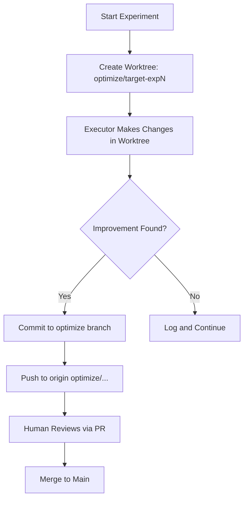

# Auto-Workflow Knowledge

Auto-workflow is an autonomous Emacs AI agent system that automatically optimizes code targets without human intervention. This knowledge page consolidates the core patterns, rules, and troubleshooting guidance for running auto-workflow effectively.

## Branching Strategy

Auto-workflow uses a strict branching model to isolate experimental changes from production code until reviewed.

### Branch Format

All auto-workflow experiments use the following branch naming convention:

```
optimize/{target-name}-{hostname}-exp{N}
```

**Examples:**

| Branch Name | Target | Hostname | Experiment # |
|-------------|--------|----------|--------------|
| `optimize/retry-imacpro.taila8bdd.ts.net-exp1` | retry | imacpro.taila8bdd.ts.net | 1 |
| `optimize/utils-imacpro.taila8bdd.ts.net-exp3` | utils | imacpro.taila8bdd.ts.net | 3 |
| `optimize/main-imacpro.taila8bdd.ts.net-exp2` | main | imacpro.taila8bdd.ts.net | 2 |

### The Branching Rule

```
λ auto-workflow-branching(x).
    change(x) → branch(optimize/{target}-{hostname}-exp{N})
    | push(optimize/...) → origin/optimize/...
    | ¬push(main)
    | human_review → merge(main)
```

**Key Constraints:**
- Changes are NEVER pushed directly to `main`
- Always push to `origin optimize/...` branch
- Human must review and merge via PR
- Multiple machines can optimize the same target without conflict

### Workflow Execution Flow



**Step-by-Step:**

1. **Create worktree** with optimize branch
   ```bash
   git worktree add -b optimize/retry-exp1 ../retry-exp1 origin/main
   ```

2. **Executor makes changes** in worktree (isolated from main)

3. **If improvement** → commit to optimize branch
   ```bash
   cd ../retry-exp1
   git add -A
   git commit -m "Improve retry logic"
   ```

4. **Push to origin optimize/...** (NOT main!)
   ```bash
   git push origin optimize/retry-exp1
   ```

5. **Human reviews** and merges to main via PR

### Code Location

The branch push logic lives in `gptel-tools-agent.el:1134`:

```elisp
(when gptel-auto-experiment-auto-push
  (magit-git-success "push" "origin" gptel-auto-workflow--current-branch))
```

**Critical Rule:** Always verify the current branch before pushing. A common mistake is pushing directly to main, which violates the branching rule.

---

## The "Never Ask" Principle

Auto-workflow is fully autonomous. It never pauses to ask the user for input, confirmation, or clarification.

### The Principle

```
λ autonomous(x).
    fail(x) → retry(x)
    | retry(x) → retry(x)
    | max_retries → log_and_continue
    | ¬ask(user)
    | ¬stop_for_input
```

### What This Means

Auto-workflow never asks for:
- Confirmation ("Proceed?")
- Input ("What should I do?")
- Decision ("Which option?")
- Clarification ("What do you mean?")

Instead, it implements automatic retry and fallback patterns.

### Retry Pattern Implementation

```elisp
(defun gptel-auto-workflow--with-retry (fn max-retries delay)
  "Call FN with automatic retry on failure, never ask user.
MAX-RETRY attempts with DELAY seconds between each."
  (let ((attempts 0)
        (last-error nil))
    (while (< attempts max-retries)
      (cl-incf attempts)
      (condition-case err
          (funcall fn)  ; Try the operation
        (error
         (setq last-error err)
         (when (< attempts max-retries)
           (message "[Retry %d/%d] %s"
                    attempts max-retries
                    (error-message-string err))
           (sleep-for delay))))  ; Brief pause, then retry
    (when last-error
      (signal (car last-error) (cdr last-error)))))
```

### Failure Response Matrix

| Failure | Don't Do This | Do This |
|---------|---------------|---------|
| Worktree create fails | Ask user "Retry?" | Retry automatically with exponential backoff |
| Test fails | Ask "Continue?" | Log and continue to next target |
| LLM timeout | Ask "What now?" | Retry with shorter prompt |
| Push fails | Ask "Force push?" | Retry with fresh auth |
| Buffer killed | Ask "Recreate?" | Recreate buffer automatically |

### Prohibited Functions

**Never use these in auto-workflow code:**
- `y-or-n-p`
- `yes-or-no-p`
- `read-from-minibuffer`
- `completing-read`
- `read-string`
- `user-error` (for recoverable issues)

**Always use instead:**
- Retry logic with `condition-case`
- Fallback paths
- Error logging with `message`
- Continue to next task

---

## Multi-Project Configuration

Auto-workflow can run against multiple projects using Emacs' built-in `.dir-locals.el` mechanism.

### Project Detection Priority

`gptel-auto-workflow--project-root` now checks in this order:

1. **Override variable** (from .dir-locals.el)
   - Variable: `gptel-auto-workflow--project-root-override`
2. **Git root** (auto-detected)
   - Command: `git rev-parse --show-toplevel`
3. **Fallback**
   - Default: `~/.emacs.d/`

### Configuration via .dir-locals.el

Place `.dir-locals.el` in your project root:

```elisp
((nil
  . ((gptel-auto-workflow--project-root-override . "/path/to/project")
     (gptel-auto-workflow-targets . ("src/main.el" "src/utils.el" "src/config.el"))
     (gptel-auto-experiment-max-per-target . 5)
     (gptel-auto-experiment-time-budget . 1200)
     (gptel-backend . gptel--dashscope)
     (gptel-model . qwen3.5-plus)
     (gptel-auto-experiment-auto-push . t))))
```

### Usage for Git Projects

1. Create `.dir-locals.el` in project root
2. Set `gptel-auto-workflow-targets` for that project
3. Auto-workflow will use git root automatically

```bash
cd ~/my-project
git init  # if not already a git repo
# Create .dir-locals.el with targets
```

### Usage for Non-Git Projects

1. Create `.dir-locals.el` in project root
2. Set `gptel-auto-workflow--project-root-override` to absolute path
3. Auto-workflow will use that path instead of git detection

```elisp
((nil
  . ((gptel-auto-workflow--project-root-override . "/Users/me/projects/legacy-code")
     (gptel-auto-workflow-targets . ("main.pl" "utils.pl" "config.pl")))))
```

### Manual Project Switching

```elisp
M-x gptel-auto-workflow-set-project-root
```

This prompts for a new project root path and updates the workflow context.

---

## Session Architecture (Per Worktree)

Each experiment runs in its own Git worktree with isolated context:

```
┌─────────────────────────────────────────────────────────┐
│  WORKTREE: optimize/target-exp1                         │
│  (default-directory: /path/to/worktree)                │
│  ┌─────────────┐ ┌─────────────┐ ┌─────────────┐       │
│  │  analyzer   │ │  executor   │ │   grader    │       │
│  │  subagent   │ │  subagent   │ │  subagent   │
│  └─────────────┘ └─────────────┘ └─────────────┘       │
│  All subagents share worktree context                  │
│  default-directory = worktree path                     │
└─────────────────────────────────────────────────────────┘
```

**Key Points:**
- Each worktree has its own `default-directory`
- All subagents (analyzer, executor, grader) share the same worktree context
- Changes are committed to the worktree branch, not main
- Worktrees are automatically cleaned up after merge

---

## Common Bugs and Fixes

### E2E Bug: Deleted Buffer

**Symptoms:**
- Project buffer `*gptel-agent:.emacs.d*` gets deleted during execution
- Executor runs for 560s+ without completing changes
- No results logged to TSV file
- Error: `gptel callback error: (error "Selecting deleted buffer")`

**Root Cause:**
The `gptel-auto-workflow--advice-task-override` advice overrides `current-buffer` to return a fixed project buffer. If that buffer is killed during async execution, all callbacks fail.

**Fix Applied:**

```elisp
;; 1. Protect buffer from being killed during runs
(add-hook 'kill-buffer-query-functions
          #'gptel-auto-workflow--protect-buffer-hook)

(defun gptel-auto-workflow--protect-buffer-hook ()
  "Prevent killing project buffer during active workflow."
  (if (and (boundp 'gptel-auto-workflow--running)
           gptel-auto-workflow--running
           (string-match-p "gptel-agent" (buffer-name)))
      (progn
        (message "Refusing to kill buffer during workflow")
        nil)  ; Don't kill
    t))

;; 2. Check buffer liveness in current-buffer override
(defun gptel-auto-workflow--current-buffer-override ()
  "Override current-buffer to return project buffer."
  (let ((buf (get-buffer gptel-auto-workflow--project-buffer-name)))
    (if (and buf (buffer-live-p buf))
        buf
      ;; Buffer was killed, fall back to original
      (funcall gptel-auto-workflow--original-current-buffer))))
```

**Result:**
- E2E test passed - experiment completed in 230s with `kept` decision
- Score improved: 0.40 → 0.41
- Commit `bae1b73` merged to staging

### Branch Push to Main Mistake

**Error:** On 2026-03-25, auto-workflow changes were pushed directly to main, violating the branching rule.

**Prevention:**
Always verify branch before pushing:

```elisp
(defun gptel-auto-workflow--safe-push ()
  "Push only if on optimize branch, never main."
  (let ((current-branch (magit-git-string "rev-parse" "--abbrev-ref" "HEAD")))
    (if (string-prefix-p "optimize/" current-branch)
        (magit-git-success "push" "origin" current-branch)
      (error "Refusing to push: not on optimize branch (currently %s)"
             current-branch))))
```

---

## Configuration Variables Quick Reference

| Variable | Description | Default |
|----------|-------------|---------|
| `gptel-auto-workflow--project-root-override` | Manual project path | `nil` |
| `gptel-auto-workflow-targets` | Files to optimize | `("init.el")` |
| `gptel-auto-experiment-max-per-target` | Max experiments per target | `3` |
| `gptel-auto-experiment-time-budget` | Time budget in seconds | `3600` |
| `gptel-auto-experiment-auto-push` | Auto-push to origin | `t` |
| `gptel-backend` | LLM backend to use | `gptel--dashscope` |
| `gptel-model` | Model name | `qwen3.5-plus` |

---

## Related

- [gptel-tools-agent.el](lisp/modules/gptel-tools-agent.el) - Main implementation
- [Git Worktree Documentation](https://git-scm.com/docs/git-worktree) - Worktree management
- [Emacs .dir-locals.el](https://www.gnu.org/software/emacs/manual/html_node/emacs/Directory-Variables.html) - Per-directory settings
- [Magit Documentation](https://magit.vc/manual/) - Git porcelain for Emacs
- [Auto-Workflow E2E Tests](test/gptel-auto-workflow-e2e.el) - Test suite

---